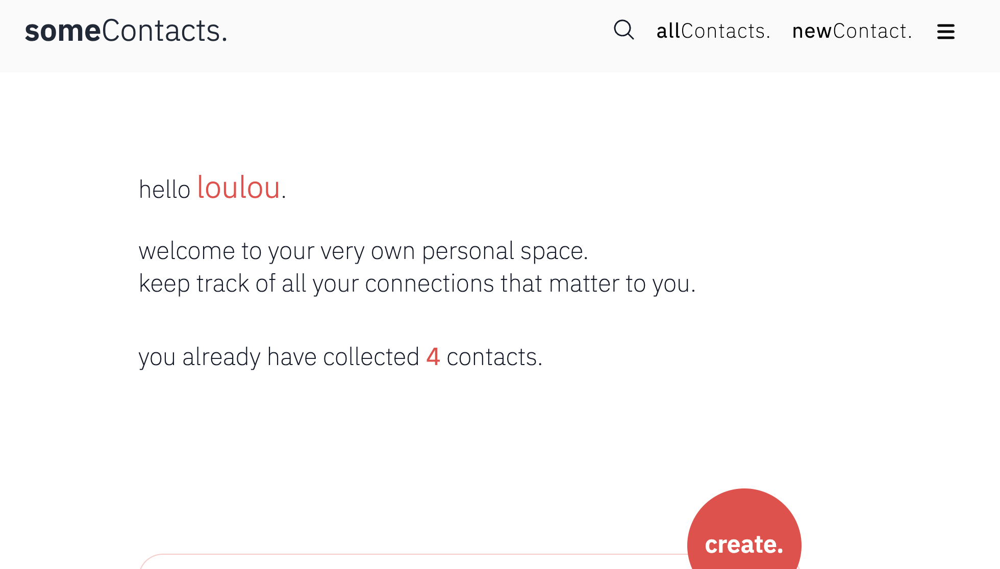

# 📇 someContacts - Personal Contact Management 

A modern contact management application built with Python & Flask (backend) and for the frontend with React and styled with tailwindcss for a beautiful, minimalist design. 
Store, organize, and manage your contacts with an intuitive interface and powerful features.



## 🚀 Features Overview

### 🔐 **Authentication & Security**
- User registration and login
- JWT-based authentication with access and refresh tokens
- Database-based token blacklisting for secure logout
- Password strength validation (uppercase, lowercase, numbers, 8+ characters)
- Email format validation
  
- User-specific data isolation
- User Profile Management
- Edit personal information, profile photo, and password
Protected Routes - Secure access to user data

### 👥 **Contact Management**
- Create, read, update, and delete contacts
- Comprehensive contact information storage
- Advanced search across multiple fields
- Pagination support for large contact lists
- Favorites system for important contacts
- Bulk operations (bulk delete)

## **handle Contacts** in App 
- Add New Contacts - Create contacts with comprehensive information
- View All Contacts - Browse contacts in a beautiful grid layout
- Edit Contacts - Update contact information with inline editing
- Delete Contacts - Remove contacts with confirmation dialogs
- Search & Filter - Find contacts by name, email, category, or status
- Favorite Contacts - Mark important contacts with star system

### 🏷️ **Category System**
- Create custom categories for organizing contacts
- Assign up to 3 categories to each contact
- Category-based filtering
- Protected categories (user-specific)

### 🔍 **Advanced Search & Filtering**
- Filter by categories (including uncategorized)
- Search across name, email, city and country
- Filter by favorites
- Combine multiple filters
- Pagination with customizable page sizes

### 📊 **Data Features**
- Rich contact profiles with personal and professional information
- Date tracking (birth dates, last contact dates)
- Address information storage
- Notes and custom fields
- Contact history tracking

## 🎨 User Experience
- Dark/Light Theme - Toggle between themes with system preference detection
- Responsive Design - Works perfectly on mobile, tablet, and desktop
- Smooth Animations - Polished transitions and hover effects
- Intuitive UX Design - for easy navigation, clean, easy-to-use interface
- Form Validation - Real-time validation with helpful error messages


## 🏗️ Technical Backend Architecture

### **Backend Stack**
- **Framework**: Flask (Python)
- **Database**: SQLite with SQLAlchemy ORM
- **Authentication**: Flask-JWT-Extended
- **Password Security**: Flask-Bcrypt
- **CORS**: Flask-CORS for frontend integration
- **Database Migrations**: Flask-Migrate

### **Database Schema**
- **Users**: Authentication and user management
- **Token Blacklist**: Secure logout functionality
- **Contacts**: Complete contact information
- **Categories**: User-defined contact categories
- **Contact-Categegories**: Junction Table for saving multiple categories per user
- **Adresses**: Saving multiple adresses per user

### **Security Features**
- JWT token authentication
- Database-based token blacklisting
- Password hashing with bcrypt
- User data isolation
- Input validation and sanitization


## 📊 Database Models Examples

### **User Model**
```json
{
    "id": 1,
    "email": "user@example.com",
    "first_name": "John",
    "last_name": "Doe",
    "created_at": "2025-06-25T12:00:00"
}
```

### **Contact Model**
```json
{
    "id": 1,
    "creator_id": 1,
    "first_name": "Alice",
    "last_name": "Johnson",
    "email": "alice@example.com",
    "phone": "+1234567890",
    "is_favorite": true,
    "birth_date": "15-05-1985",
    "is_contacted": false,
    "is_to_contact": false,
    "last_contact_date": "20-06-2025",
    "last_contact_place": "Coffee Shop Downtown",
    "street_and_nr": "123 Main Street",
    "postal_code": "12345",
    "city": "New York",
    "country": "USA",
    "notes": "Great person to work with!",
    "created_at": "25-06-2025 12:50:12",
    "updated_at": "25-06-2025 12:50:12",
    "categories": {
        "id": 1,
        "name": "Work Colleagues"
    }
}
```

### **Category Model**
```json
{
    "id": 1,
    "name": "Work Colleagues",
    "creator_id": 1,
    "created_at": "2025-06-25T12:00:00",
    "contact_count": 5
}
```


---
## 🏗️ Technical Frontend Architecture

### **Core Technologies**
- **React**: Modern React with hooks and functional components
- **React Router DOM**: Client-side routing and navigation
- **Vite**: Fast build tool and development server

### **Styling & UI**
- **Tailwind CSS**: Utility-first CSS framework
- **IBM Plex Sans Devanagari**: Custom typography
- **Custom Components**: Reusable UI components

### **State Management**
- **React Context**: Authentication and theme management
- **React Hooks**: useState, useEffect, useRef for local state
- **Custom Hooks**: Reusable logic patterns

### **Form Handling**
- **Controlled Components**: React-managed form state
- **Real-time Validation**: Instant feedback on form inputs
- **Error Handling**: Comprehensive error states and messages


## 🎨 Design System

### **Color Palette**
- **Primary Red**: #ef4444 (red-500)
- **Dark Red**: #dc2626 (red-600)
- **Light Red**: #fef2f2 (red-50)
- **Text**: #000000 (black) / #ffffff (white)
- **Gray Scale**: Tailwind's gray palette

### **Typography**
- **Font Family**: 'IBM Plex Sans Devanagari'
- **Weights**: 200 (extralight), 300 (light), 400 (normal), 600 (semibold)
- **Sizes**: Responsive scaling with Tailwind classes

### **Components**
- **Cards**: Rounded corners (3xl), subtle shadows
- **Buttons**: Circular design with hover effects
- **Forms**: Floating labels with red accent colors

src/
├── components/           # Reusable UI components
│   ├── forms/           # Form components
│   ├── layout/          # Layout components (Navbar, Cards)
│   ├── theme/           # Theme toggle and context
│   └── ui/              # Basic UI components (Buttons, Photo)
├── context/             # React Context providers
│   ├── AuthContextProvider.jsx
│   └── ThemeContext.jsx
├── pages/               # Page components
│   ├── Login.jsx
│   ├── Register.jsx
│   ├── Home.jsx
│   ├── AllContacts.jsx
│   ├── NewContact.jsx
│   ├── ShowContact.jsx
│   ├── AllCategories.jsx
│   └── UserProfile.jsx
├── apiCalls/            # API integration
│   ├── authApi.js
│   └── contactsApi.js
├── styles/              # Global styles
└── App.jsx              # Main application component
